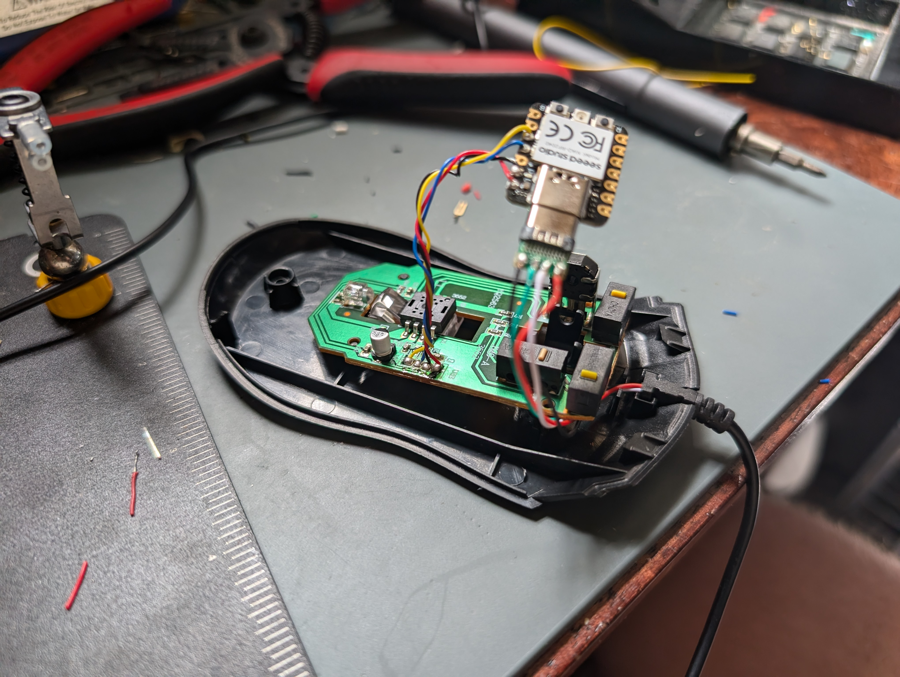

## WHAT?

A mouse with a game of Pong running inside it's firmware, rendered on screen by moving the cursor really fast!

## Demo

https://github.com/user-attachments/assets/f5d2ad66-0942-43ed-bbec-080b894ee467

Notes:
- The game stops/starts when I _click_ the scroll wheel. Otherwise the mouse acts normally.
- The score is rendered after a point is scored by showing the cursor somewhere between the left and right "paddles". The closer to a given paddle, the more that player is winning by (it's a ratio). If the cursor is in the middle, the score is tied.

## Hardware Details
My code runs on an [Seeed Studio XIAO RP2040](https://wiki.seeedstudio.com/XIAO-RP2040/) dev board, which - using the magic of [TinyUSB](https://docs.tinyusb.org/en/latest/) - can act as both a custom USB device _and_ host.  I detached the USB connection from the inside of a cheap HP mouse and fed it into the XIAO's USB port (this goes to the computer). I then wire up the aux USB connection using the XIAO's power/GPIO pins, which goes back to the original mouse's PCB. This creates a USB interceptor that can be programmed to do whatever! Also see my [Mouse/Keyboard effects pedal](https://github.com/dupontgu/hidden_agenda_pedal) :P.

## How It Works
Most modern computer mice using relative positioning - they report _changes_ in their movement. If you move the mouse slowly to the left, it might spit out a bunch of packets where the x component is just -1 (meaning the mouse moved 1 "pixel" to the left). However! It is possible to implement a USB mouse that uses _absolute_ positioning. It can send an exact position on your monitor (percentage X, percentage Y) that the cursor should move to instantly. This is commonly used for touchscreen drivers - you want the cursor to appear where the finger touches the screen.  This firmware emulates an absolute positioning mouse and quickly moves the mouse cursor between points of interest. It moves fast enough that the cursor (kinda) appears in all positions at once and gives the impression that it is in multiple places at once. I have implemented a simple game of Pong to run in the firmware, and set the cursor's points of interest to be the 2 paddles and the ball while the game is active. So the game runs completely inside the mouse!

## Setup
1. You'll need hardware! Any RP2040 based board wired up with a second USB port will do, but I recommend Adafruit's [Feather RP2040 with USB Host](https://www.adafruit.com/product/5723).
2. Follow [Adafruit's guide](https://learn.adafruit.com/adafruit-feather-rp2040-with-usb-type-a-host/arduino-ide-setup) for getting set up with the Arduino IDE.
3. Install the Adafruit TinyUSB Library and the Pico PIO USB Library (again, [guide](https://learn.adafruit.com/adafruit-feather-rp2040-with-usb-type-a-host/usb-host-device-info)).
4. Ensure that your USB D+/D- pins are [set correctly](./usbh_helper.h).
5. Build and run!
